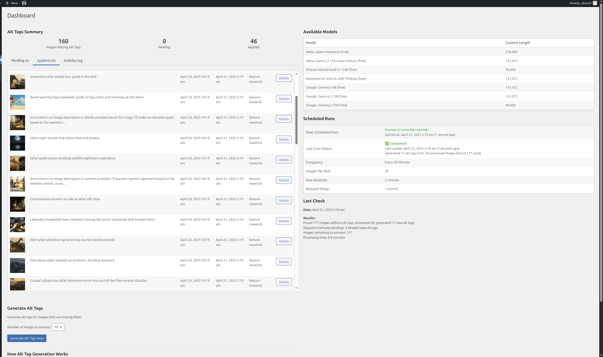

# 🖼️ OpenRouted - AI Alt Tags Generator for WordPress

Use your daily free vision model quota from OpenRouter.ai to maintain your image alt tags! Never worry about missing alt text again.

## 🤖 What is this magic?

OpenRouted is a **zero-setup AI solution** that automatically generates descriptive alt tags for your WordPress images. No more tedious manual writing of alt text!

*"But wait, don't AI solutions cost money?"* Not this one! OpenRouted leverages OpenRouter's **free daily quota** of AI vision calls, making this accessible to everyone.

## 📸 Dashboard Overview

## ✨ Features that'll make you smile

- **🧙‍♂️ AI-Powered Alt Tags**: Like having a tiny image-describing wizard in your WordPress
- **🔄 Automatic Daily Checks**: Set it and forget it - checks for new images every day
- **🚀 Bulk Processing**: Fix hundreds of missing alt tags with a single click
- **👀 Preview Before Applying**: Review the AI's suggestions before they go live
- **📝 Custom Instructions**: Tell the AI how you want your alt tags written
- **🎚️ Control Modes**: Choose between full automation or manual approval

## 📊 Why alt tags matter

- **♿ Accessibility**: Help visually impaired visitors understand your content
- **🔍 SEO Boost**: Search engines love properly described images
- **📱 Mobile Optimization**: When images fail to load, alt text saves the day

## 🚀 Getting Started

1. Upload the `openrouted` folder to your `/wp-content/plugins/` directory
2. Activate through the 'Plugins' menu
3. Navigate to **Alt Tags AI > Settings**
4. Get your free [OpenRouter API key](https://openrouter.ai/) (takes just 30 seconds - no credit card required!)
5. Choose your settings & let the magic happen!

## 🧠 How It Works

1. Plugin scans for images missing alt tags
2. It sends the image to OpenRouter's AI vision models
3. The AI analyzes the image and generates descriptive alt text
4. You review and apply (or automatically apply) the suggestions
5. Your website becomes more accessible and SEO-friendly!

## 💻 Requirements

- WordPress 5.0+
- PHP 7.2+
- Free OpenRouter API key

## 🤔 FAQ

### Is it really free?
Yes! The plugin is free and uses OpenRouter's free daily quota. No credit card required. OpenRouter provides transparent usage tracking so you can easily monitor your API consumption.

### How do I get an OpenRouter API key?
Simply visit [OpenRouter.ai](https://openrouter.ai/), create a free account, and generate an API key. The process takes less than a minute and requires no payment information.

### Is my data secure?
We only send your images to OpenRouter's API. Your API key is stored securely in your WordPress database. OpenRouter offers a user-friendly dashboard to monitor all API activity.

### Can I customize the AI output?
Absolutely! Use the custom instructions to specify tone, focus, or keywords.

### Will this work with my existing images?
Yes! The plugin can scan your entire media library and generate alt tags for any images missing them.

## 🤝 Contributing

Pull requests are welcome! Feel free to help make this plugin even better.

## 📄 License

GPL v2 or later

---

Made with ❤️ by [OpenRouted](https://openrouted.com) | [Report Issues](https://openrouted.com/issues)